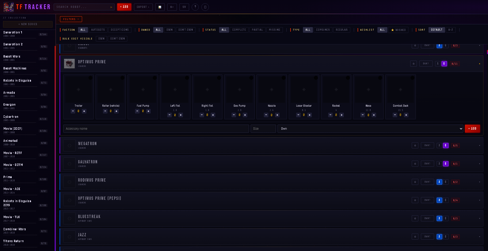

# TF Tracker 🤖

A local web app for tracking your Transformers figure collection — accessories, completion status, photos and all.



Built for collectors who want full control of their data without cloud services or subscriptions.


---

## Features

- **18 series** pre-loaded — G1 through Titans Return (2,600+ figures)
- Track accessories and parts per figure (have / missing)
- Upload photos for each figure and accessory
- Filter by faction (Autobot / Decepticon), status, type
- Sidebar navigation between collections
- PDF export per series
- 100% local — no internet required after setup

---

## Requirements

- Python 3.8 or newer
- Works on Windows, macOS, Linux

---

## Installation

### Option A — One-click installer (recommended)

**Windows:**
1. Download or clone the repo
2. Double-click `install.bat`
3. Done — the app opens automatically

**macOS / Linux:**
```bash
bash install.sh
```

The installer checks Python, installs dependencies, seeds the database and creates a desktop shortcut.

---

### Option B — Manual

**1. Clone the repo**
```bash
git clone https://github.com/Rubotnic/tf-tracker.git
cd tf-tracker
```

**2. Install dependencies**
```bash
pip install flask reportlab
```

**3. Populate the database**
```bash
python seed.py
```
Answer `yes` when prompted. This creates `tracker.db` with all figures across all 18 series.

**4. Start the app**

Windows — double-click `TF Tracker.bat`

macOS / Linux:
```bash
python app.py
```

The browser opens automatically at `http://localhost:5000`

---

## Project structure

```
tf-tracker/
├── app.py            # Flask backend — all API routes
├── index.html        # Frontend — the full UI in one file
├── seed.py           # One-time database seeder
├── install.bat       # One-click installer for Windows
├── install.sh        # One-click installer for macOS / Linux
├── requirements.txt
├── tracker.db        # Your collection data
└── images/           # Uploaded photos
```

---

## Backup

Your data lives in two places. Copy both to back up:

| What | Where |
|------|-------|
| All figures, accessories, status | `tracker.db` |
| All uploaded photos | `images/` folder |

---

## Series included

| Series | Short | Years | Figures |
|--------|-------|-------|---------|
| Generation 1 | G1 | 1984–1990 | 344 |
| Generation 2 | G2 | 1993–1995 | 93 |
| Beast Wars | BW | 1996–2001 | 114 |
| Beast Machines | BM | 2000–2001 | 61 |
| Robots in Disguise | RID01 | 2001–2003 | 73 |
| Armada | ARM | 2002–2003 | 64 |
| Energon | ENE | 2003–2005 | 84 |
| Cybertron | CYB | 2005–2006 | 118 |
| Movie (2007) | MOV1 | 2007–2008 | 194 |
| Animated | ANI | 2008–2010 | 88 |
| Movie – ROTF | ROTF | 2007–2010 | 213 |
| Movie – DOTM | DOTM | 2011–2012 | 154 |
| Prime | PRI | 2011–2020 | 166 |
| Movie – AOE | AOE | 2013–2014 | 87 |
| Robots in Disguise 2015 | RID15 | 2015–2017 | 290 |
| Movie – TLK | TLK | 2017–2018 | 104 |
| Combiner Wars | CW | 2015–2018 | 73 |
| Titans Return | TR | 2016–2018 | 76 |

---

## Contributing

Pull requests welcome! Useful contributions:

- Missing figures or accessories
- Bug fixes
- UI improvements
- Additional series (Power of the Primes, War for Cybertron etc.)

Please open an issue before starting larger changes.

---

## License

MIT — free to use, modify and distribute.
